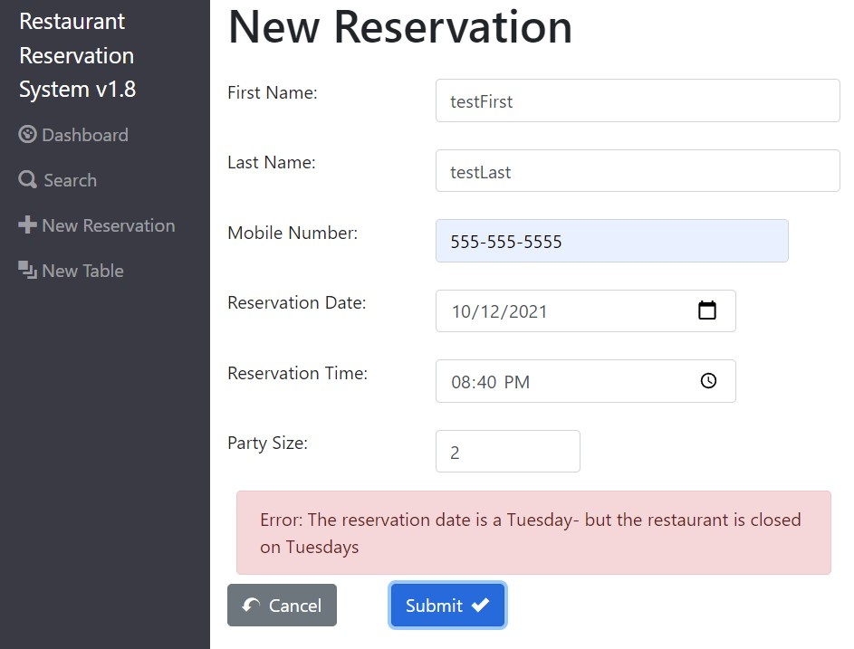
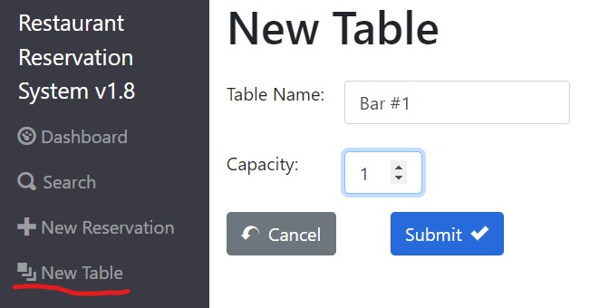
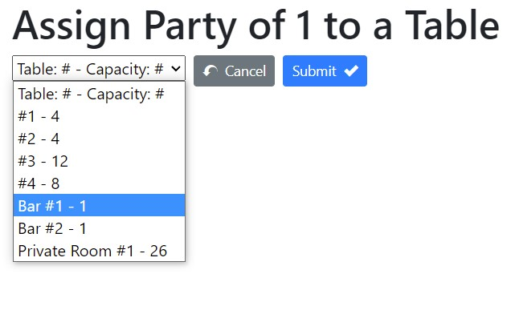
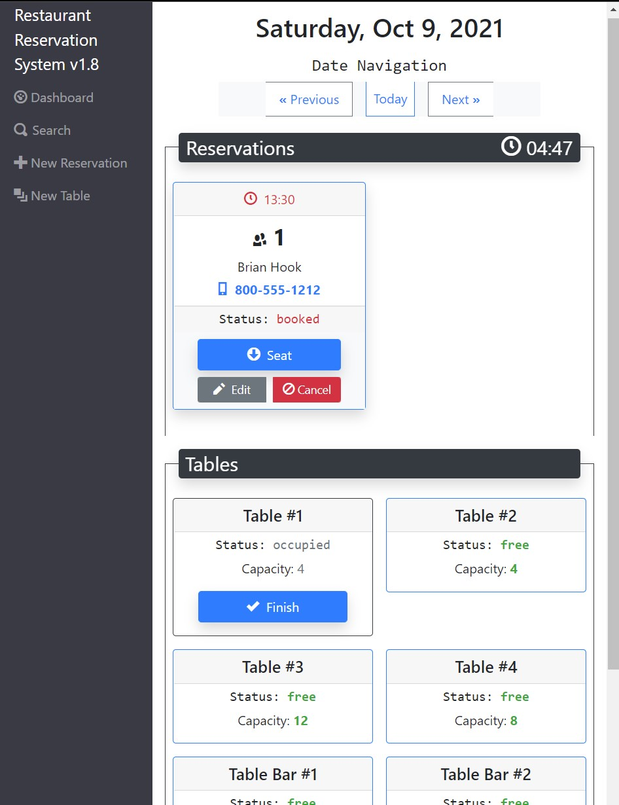
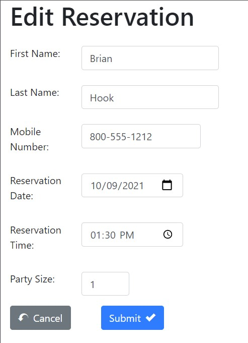
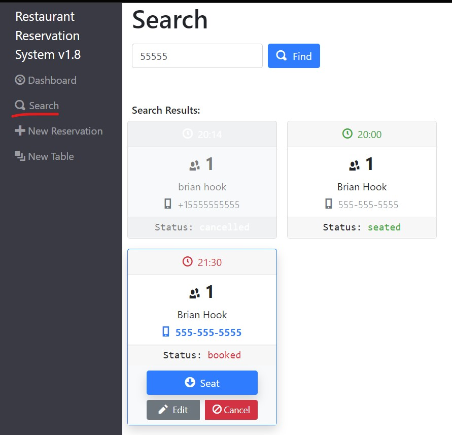

# Restaurant Reservation System

## Live Demo

[Restaurant Reservation System](https://final-capstone-frontend.herokuapp.com/)

This is a full stack capstone project for Thinkful's software engineering bootcamp. The following scenario was given as a prompt:

> You have been hired as a full stack developer at a startup that is creating a reservation system for fine dining restaurants.
> The software is used only by restaurant personnel - at this point, the customers will not access the system online.

## User Stories

The application was developed following the user stories supplied by a figurative manager, using a test driven development process. Users (restaurant employees) of this application can currently:
- Create a new reservation (when a customer calls in) with contact details

  - Multiple validations ensure a reservation can not be made outside of business hours

- Create instances of each table and seating capacity that are available to customers so that reservations can be assigned to a table when the party arrives at the restaurant

- View a dashboard for the current day (with date navigation to other days available) that shows reservations and tables in the same view to make managing the flow of customers in and out of the restaurant

- Update a reservation with new details if a customer calls back and needs to make an update

  - Search for that reservation using partial match of phone number used for the reservation

- Control the displayed "Status" of a reservation and a table through the lifecycle of a party arriving, eating, and leaving the restaurant

## Technologies used

*Back-end*
- Node
- Express
- Knex
- PostgreSQL (via ElephantSQL)
- Jest

*Front-end*
- React (router, hooks, error boundaries, etc...)
- Bootstrap
- e2e tests

## Back-end

API Base Url: https://final-capstone-backend.herokuapp.com

| Endpoint | Description |
| - | - |
| `GET /reservations` | returns all reservations |
| `POST /reservations` | creates and returns a new reservation |
| `GET /reservations?date='YYYY-MM-DD'` | returns reservations by date (sorted asc) |
| `GET /reservations?mobile_number=123` | returns reservations by partial match of phone number |
| `GET /reservations/:reservationId` | returns reservation matching the reservationId |
| `PUT /reservations/:reservationId` | updates and returns the reservation matching the reservationId |
| `PUT /reservations/:reservationId/status` | updates only the status of a reservation |
| `GET /tables` | returns all Tables |
| `POST /tables` | creates and returns a new table |
| `PUT /tables:table_id/seat` | updates a table with a reservationId and changes status to "occupied" |
| `Delete /tables:table_id/seat` | updates a table by deleting reservationId and changes status to "free" |

## Installation

1. Fork and clone this repository.
1. Run `cp ./back-end/.env.sample ./back-end/.env`.
1. Update the `./back-end/.env` file with db connections. You can set some up for free with ElephantSQL database instances.
1. Run `cp ./front-end/.env.sample ./front-end/.env`.
1. You should not need to make changes to the `./front-end/.env` file unless you want to connect to a backend at a location other than `http://localhost:5000`.
1. Run `npm install` to install project dependencies.
1. Run `npm run start:dev` from the back-end directory to start your server in development mode.
1. Run `npm start` from the front-end directory to start the React app at http://localhost:3000.